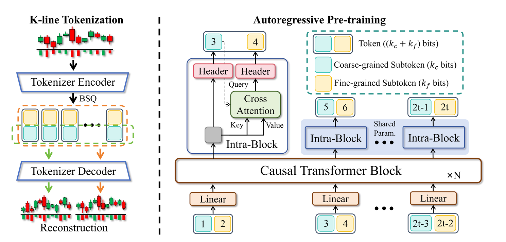
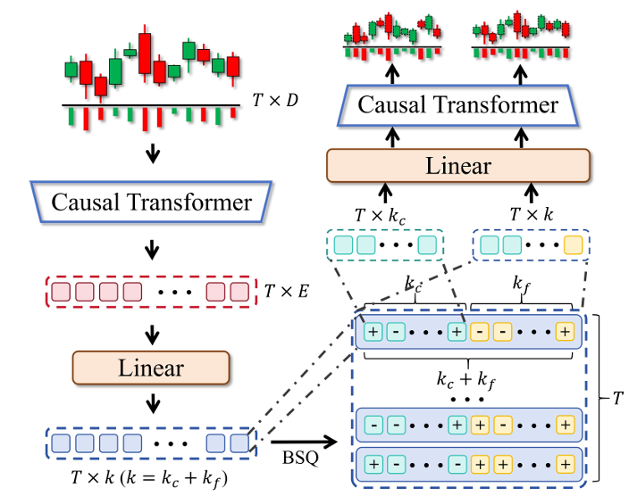

# Kronos: A Foundation Model for the Language of Financial Markets
https://github.com/shiyu-coder/Kronos
## 今天我们要介绍的是Krones，一个由清华大学开源的K线基础模型
1. 什么是基础模型（LM）？
	- 基础模型通常指在大规模数据上预训练、可迁移到多任务的通用模型。本文中的LM由股票，期货，虚拟币等市场数据训练，学习到了所有类型金融市场中的共有规律，再经过微调对齐特定数据，可以泛化适应到不同市场
2. 什么是K线？
	- K线（OHLC）用开盘价、最高价、最低价、收盘价刻画一个时间窗口内的价格行为。
3. 本文的核心技巧？
    - tokenizer的设计可以理解为一种创新的编码器，核心思想是LLM中的token化——将某K线的时间序列数据通过训练后的编码器变成可以用于训练的token。然后再输入transformer，效果非常好，让transformer第一次在这个高信噪比的环境中表现了极强的ts能力。

## Kronos训练的工作流

### 第一部分：token化（其实这里可能会有人有疑问，K线数据本来就是离散的向量，似乎并不需要像文本一样进行向量化之后才可以训练，然而这正是这篇文章的巧妙之处，是一种数据处理的胜利，使得在多种市场中的共同规律被提取成为可能）
1. 数据准备：K天内的数据矩阵

$$
\mathbf{X}=
\begin{bmatrix}
o_1 & h_1 & l_1 & c_1 & n_1 & a_1 \\
o_2 & h_2 & l_2 & c_2 & n_2 & a_2 \\
\vdots & \vdots & \vdots & \vdots & \vdots & \vdots \\
o_T & h_T & l_T & c_T & n_T & a_T
\end{bmatrix}
$$

其中第 1 行就是“第一天的 OHLCNA”，第 $t$ 行就是“第 $t$ 天的 OHLCNA”

2. tokenizer encoder的设计与训练（如果直接输入OHLCNA向量，将直接变成时序回归任务，既无法用注意力机制，也会让不同市场，不同股票间的数据不能统一）
* 目标：得到OHLCNA变换后的粗细特征。
* BSQ的使用（vae需要维护可学习码本，容易塌缩）：借鉴了CV中的连续数据处理办法，将数据空间连续的数据离散化为Token id，同时不依赖可学习码本，而且又消除了模长冗余。
* BSQ的方法：先两次线性投影（这个投影矩阵需要学习），再模长归一化，然后sign函数生成二进制模式，再进行n(=2)值分割为粗细两个维度，归一化中失去了幅度，保留了方向，对于金融来说正是失去了方向保留了特征。
* 损失函数：

$$
\mathcal{L}_{\text{tokenizer}} = \mathcal{L}_{\text{coarse}} + \mathcal{L}_{\text{fine}} + \lambda \mathcal{L}_{\text{quant}}
$$

其中 $\lambda$ 是平衡超参数，各项定义为：

- $\mathcal{L}_{\text{coarse}} = \mathbb{E}\left[\left\|\mathbf{x} - E_{\text{dec}}(\mathbf{b}^{c})\right\|^{2}\right]$：训练 coarse subtoken $\mathbf{b}^{c}$ 形成低保真重构。
- $\mathcal{L}_{\text{fine}} = \mathbb{E}\left[\left\|\mathbf{x} - E_{\text{dec}}(\mathbf{b})\right\|^{2}\right]$：使用完整 token $\mathbf{b}$ 评估高保真重构。
- $\mathcal{L}_{\text{quant}}$：BSQ 的量化损失，用于正则化训练过程；它约束连续潜变量 $\boldsymbol{\xi}$ 与其二进制编码 $\mathbf{b}$ 的 $L_2$ 距离，使编码器输出与学习到的编码空间对齐，从而提升训练稳定性。
* 解码器建模：仅解码器Transformer，使用因果注意力(强制掩码掉了未来数据)每一步预测仅依赖历史数据，学习到了联合概率分布，预测目标函数也即条件概率

$$
p(\mathbf{b}_{1:T})=\prod_{t=1}^{T} p\big(\mathbf{b}_t\mid \mathbf{b}_{<t}\big)
$$
$$
\mathbf{b}_{<t}=\{\mathbf{b}_1,\ldots,\mathbf{b}_{t-1}\},\quad
\max\sum_{t=1}^{T}\log p\big(\mathbf{b}_t\mid \mathbf{b}_{<t}\big)
$$
* 分层条件概率设计：利用链式法则分解概率，实质上将预测过程分为两步，首先根据粗token预测，再利用粗细token一起预测
$$
p(\mathbf{b}_t\mid \mathbf{b}_{<t})
=
p(\mathbf{b}_t^{c}\mid \mathbf{b}_{<t})
\cdot
p(\mathbf{b}_t^{f}\mid \mathbf{b}_{<t},\mathbf{b}_t^{c})
$$

$$
p(\mathbf{b}_{1:T})
=
\prod_{t=1}^{T}
\Big[
p(\mathbf{b}_t^{c}\mid \mathbf{b}_{<t})
\cdot
p(\mathbf{b}_t^{f}\mid \mathbf{b}_{<t},\mathbf{b}_t^{c})
\Big]
$$

* 粗细子 token 融合输入：$b_i^c$ 和 $b_i^f$ 分别通过两个独立的嵌入层投影为向量表示，得到 $e_c(b_i^c)$ 和 $e_f(b_i^f)$。这些嵌入向量随后被拼接，并通过线性投影生成融合输入向量：

$$
\mathbf{v}_i = W_{\mathrm{fuse}}\left([e_c(b_i^c); e_f(b_i^f)]\right) \quad (5)
$$

其中 $[\cdot;\cdot]$ 表示拼接操作，$W_{\mathrm{fuse}}$ 是可学习的权重矩阵，负责将组合表示投影到模型的隐空间中。生成的v序列将用于隐状态h_i生成，并在下一步生成token预测输出。
$$
p(\mathbf{b}_t^{c}\mid \mathbf{b}_{<t}) = \operatorname{softmax}(W_c\mathbf{h}_t)
$$
这里我们生成了由粗token预测生成的logits
* 细token生成方法：
1. 首先我们回忆前面的公式，细token的预测结合了粗token，为了建模这一关系，我们使用交叉注意力。
>**交叉注意力**：区别于自注意力，我们希望用来自于Q中的信息去K/V里面提取信息

$$
\mathbf{h}_t^{\mathrm{update}} = \mathrm{CrossAttn}(q = e_c(\hat{b}_t^{c}),\ k = v = \mathbf{h}_t)
$$

$$
p(b_t^{f}\mid \mathbf{b}_{<t}, \hat{b}_t^{c}) = \operatorname{softmax}(W_f\mathbf{h}_t^{\mathrm{update}})
$$

2. query来自粗token生成，key和value来自历史隐状态，相当于拿着生成的大致坐标去历史数据里面查询，得到结果远远强于直接自注意力。先找重点，再查细节。
3. 拼接得到新token，此时时序预测完成，只需逆量化即可得到新数据。
4. 最后使用对数似然评估。
ps:我们使用模型前一步的预测结果,而非真实子 token（即不使用教师强制（teacher-forcing））。我们发现这种采样策略通过减轻暴露偏差（exposure bias）提升了模型鲁棒性，使训练分布与多步推理的自回归特性（此时真实 token 不可用）更好地对齐。
>**teacher-forcing**:每一步训练都使用真实数据，然而会导致长时序全部跑偏。本文中真实数据仅作为监督标签而存在。
* 逆量化过程：核心是预测得到离散 token 后，直接送入 tokenizer 的解码器恢复连续 K 线特征。先拼接粗细子 token，再由解码器重建。
$$
\hat{\mathbf{b}}_t=[\hat{\mathbf{b}}_t^{c},\hat{\mathbf{b}}_t^{f}],\quad
\hat{\mathbf{x}}_t=E_{\mathrm{dec}}(\hat{\mathbf{b}}_t)
$$

序列形式：

$$
\hat{\mathbf{X}}=E_{\mathrm{dec}}(\hat{\mathbf{B}})
$$
* 进入循环：得到这个新的K线数据后再带入生成新的token，进行长程推理预测。
其中 $\hat{\mathbf{X}}$ 是逆量化后的连续 OHLCNA 序列。

## 好了，我们终于熬过了令人烦躁而充满疑惑与惊讶的原理解释阶段，现在我们进入到应用阶段。
[github](https://github.com/shiyu-coder/Kronos)

[huggingface](https://huggingface.co/NeoQuasar/Kronos-base)

### 我们先直接上A股，如果存在明显领域偏差再做微调。
先运行Kronos/examples/prediction_cn_markets_day.py这个文件

### 做回测
运行Kronos/examples/run_backtest_kronos.py

### 尝试轻量微调